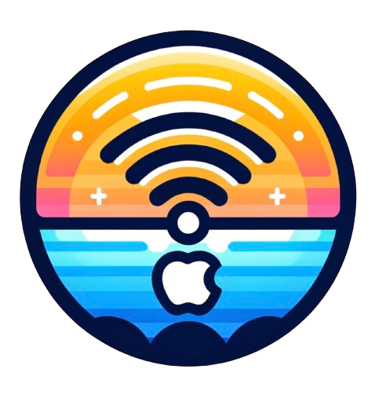

<h1>iTunes Store X</h1>

This tweak aims to fix the connection issues originating from Apple restricting access to old storefront domains, it will also restore the layout to its former self. (Does not currently allow for downloading apps).

## Usage
Download and install in cydia through my repo:

http://cydia.skyglow.es

